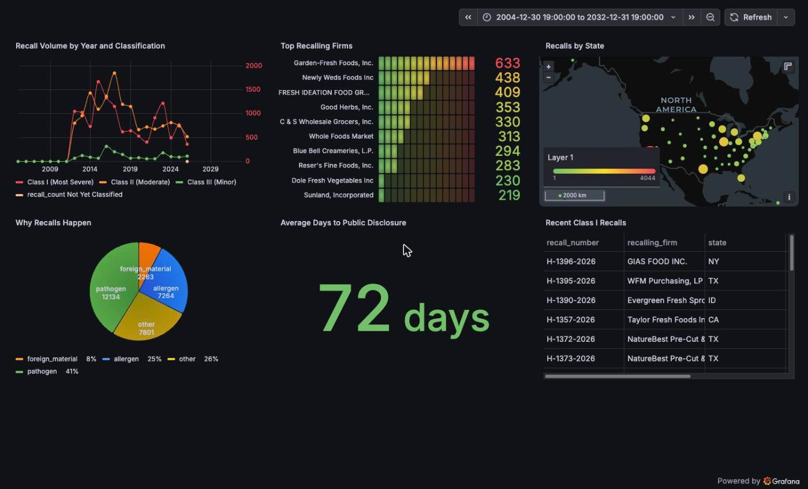
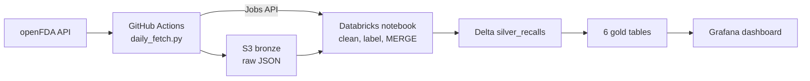

# FDA Food Recall Pipeline

[](https://github.com/ShanmuksaiHari/fdarecallpipeline/actions/workflows/tests.yml)

A daily data pipeline that pulls U.S. food recall records from the openFDA API,
stores the raw JSON in S3, cleans it into a Delta table in Databricks, builds
six summary tables, and shows them on a Grafana dashboard. It currently holds
29,462 recalls reported between June 2012 and September 2026.

**[Live dashboard (static snapshot)](https://sincereflax272.grafana.net/dashboard/snapshot/iYbrt9kfMA9vhEFSUQ9rW3Y1Th8k0qji)**



## Key results

- 29,462 recalls (June 2012 to September 2026) in one Delta table, one row per recall number
- 6 gold tables feeding the 6 dashboard panels
- 39 automated tests, run on every push with GitHub Actions
- 7 SQL data quality checks
- The daily GitHub Actions run (fetch, upload, trigger Databricks) takes about 15 seconds

## Architecture



- **Bronze:** each day GitHub Actions fetches the last 14 days of recalls and
  writes the raw JSON to S3, untouched.
- **Silver:** a Databricks notebook reads every bronze file, keeps the newest
  copy of each recall, converts the dates, adds a hazard category, and merges
  the result into the `silver_recalls` Delta table.
- **Gold:** six SQL tables aggregate silver for the dashboard.
- **Grafana** reads the gold tables.

## Tech stack

- **Python** for the fetch, upload and backfill scripts, with `requests` and `boto3`.
- **Amazon S3** for the bronze layer, holding the raw JSON.
- **Databricks, PySpark and Delta Lake** for the silver table, using MERGE so
  re-runs don't create duplicates.
- **SQL** for the six gold tables and the data quality checks.
- **GitHub Actions** for the daily schedule and the test runs.
- **pytest** for the 39 tests.
- **Grafana** for the dashboard.
- **Airflow** was used once as an orchestration demo (see below). It is not the
  live scheduler.

## Data

The source is the openFDA food enforcement endpoint, which lists recalls of
food products reported to the FDA. Each record has a recall number, the
recalling firm and state, a classification (Class I is the most serious),
the reason for the recall, and several dates. openFDA updates the feed weekly,
and the report dates in the data fall on Wednesdays.

The pipeline adds one column, `hazard_category`, by matching keywords in the
recall reason: `allergen`, `pathogen`, `foreign_material`, or `other`.

## Gold tables

| Table | What it holds | Dashboard panel |
|---|---|---|
| `recalls_by_year_class` | Recalls per year and classification | Recall Volume by Year and Classification |
| `recalls_by_firm` | The 20 firms with the most recalls | Top Recalling Firms |
| `recalls_by_state` | Recalls per state | Recalls by State |
| `recalls_by_hazard` | Recalls per year and hazard category | Why Recalls Happen |
| `disclosure_lag` | Days between a recall starting and being reported to the FDA | Average Days to Public Disclosure |
| `latest_class_one` | The 25 most recent Class I recalls | Recent Class I Recalls |

`disclosure_lag` only keeps recalls that started between 2004-01-01 and
today, because some records in the source had impossible dates.

## Findings

- Pathogens are the most common recall reason (41% of recalls), followed by
  allergens (25%) and foreign material (8%). Another 26% fall into `other`,
  because the hazard labels come from keyword rules and not every reason text
  matches one.
- The average time from a recall starting to being reported is 72 days. The
  longest is 2,270 days, from one firm's five records; that is what the source
  data says, and I kept it.
- The firm with the most recalls is Garden-Fresh Foods, Inc., with 633.

## Daily automation

GitHub Actions runs the pipeline every day at 12:00 UTC (`daily-pipeline.yml`).
It can also be started by hand, with an optional report date.

1. `daily_fetch.py` asks openFDA for every recall reported in the last 14
   days, with up to 3 retries on network errors and server errors.
2. The result is uploaded to S3 as one JSON file named after the date window,
   so a new run never overwrites an old file.
3. The workflow calls the Databricks Jobs API to run the notebook. A failed
   call fails the workflow (`curl -f`), so a broken run shows up as red.

Fetching 14 days every day is on purpose. openFDA sometimes publishes a batch
late, and the overlap means a missed day is caught up on the next run. The
overlap is safe because the silver notebook keeps the newest copy of each
recall and loads it with MERGE, so re-fetched records update rows instead of
duplicating them.

`backfill.py` loaded the history year by year. It can be re-run safely: it
skips years that are already in S3.

An Airflow DAG (`airflow_dags/`) does the same two steps. I ran it once in
Docker to try out orchestration. GitHub Actions is the live scheduler.

## Problems I hit and fixed

- **A late batch.** On Oct 1, openFDA returned no records for the Sept 30
  report date. The pipeline originally fetched only yesterday, so it would
  have missed them for good. It now re-fetches the last 14 days every run,
  which is safe because silver keeps the newest copy of each recall.
- **Daily files ignored.** The silver notebook read a fixed list of S3 paths,
  so the daily files never reached the table. It now lists every file under
  the bronze prefix. After the fix, silver went from 29,406 to 29,462 rows.
- **A failed Databricks call looked fine.** The workflow stayed green even when
  the Databricks API call failed. Adding `curl -f` makes that step fail the
  workflow, so a broken run shows up as red.
- **A crash on upload.** The workflow never passed the bucket name to the
  script, so the upload failed. I passed it in, and the code now stops with a
  clear error if the bucket name is missing.
- **Hazard rules that missed cases.** Phrases like "do not declare", "not
  declared" and "does not list" were not caught as allergens at first. I added
  those, plus E. coli, Cyclospora, Giardia, norovirus, plastic and glass.

## Testing and data quality

**Automated tests.** There are 39 pytest tests, and GitHub Actions runs them on
every push and pull request. They use fake openFDA and S3 responses, so they
need no network and no credentials. They cover the hazard rules (18), fetching
with retries and paging (8), upload keys (4), the daily date window (4), the
resumable backfill (4), and one parity test.

**The parity test.** Databricks can't import code from this repo, so the
notebook carries its own copy of the hazard rules. The test checks that the
notebook's copy and `src/hazard.py` give the same answer on a set of sample
texts, and fails if they ever disagree.

**Data quality checks.** `databricks/sql/data_quality_checks.sql` holds 7 SQL
checks that I run by hand after a pipeline run. They look at row count and
freshness, duplicate recall numbers, missing recall numbers, the hazard
split, null dates, and the disclosure-lag range. The latest run found no
duplicate recall numbers and no null dates, and one recall with the recall
number `N/A`.

**Safe re-runs.** Silver is loaded with MERGE on `recall_number`, so running
the pipeline again updates rows and never duplicates them.

## Limitations and next steps

- **Hazard labels are keyword rules.** About 26% of recalls end up as `other`.
  A reason that mentions both an allergen and a pathogen is labeled
  `allergen`, because that rule is checked first.
- **One recall has the number `N/A`.** Recall numbers are the table key, so
  two such recalls would be merged into one row.
- **Old recalls are not re-checked.** The 14-day window is by report date, so
  a status change on an older recall is only picked up if it is reported
  again in a recent batch.
- **The backfill resumes by year, not by page.** If it stops partway through a
  year, that year starts over.
- **The hazard rules live in two places** (the notebook and `src/hazard.py`).
  The parity test catches drift, but a shared package would be cleaner.
- **The dashboard is a static snapshot,** not a live view.
- **The quality checks run by hand.** Next step: run them automatically after
  each load and alert on failures.

## How to run it

You need Python 3.11, an AWS account with an S3 bucket and an IAM user that can
read and write it, and (for silver and gold) a Databricks workspace. The fetch,
upload and tests run on your own machine. The notebook and SQL run in Databricks.

```
git clone https://github.com/ShanmuksaiHari/fdarecallpipeline.git
cd fdarecallpipeline
python -m venv .venv && source .venv/bin/activate
pip install -r requirements-dev.txt
cp .env.example .env        # then fill in your own values
python -m pytest tests -v   # no credentials needed

python src/backfill.py             # one-time history load into S3
python src/daily_fetch.py          # last 14 days
python src/daily_fetch.py 20260923 # one report date
```

**Databricks.** Import `databricks/fda_recalls_silver.py` as a notebook. Create
a secret scope named `fda-pipeline` with the keys `aws_access_key_id` and
`aws_secret_access_key`, then run the notebook. It builds `silver_recalls` and
the six gold tables (also written out in `databricks/sql/gold_tables.sql`).

**GitHub Actions.** Add these repository secrets: `AWS_ACCESS_KEY_ID`,
`AWS_SECRET_ACCESS_KEY`, `DATABRICKS_HOST`, `DATABRICKS_TOKEN`,
`DATABRICKS_JOB_ID`, and optionally `FDA_API_KEY`. Change `AWS_BUCKET_NAME` in
`.github/workflows/daily-pipeline.yml` to your own bucket.

## Repository layout

```
src/                  fetch, upload, daily and backfill scripts, hazard rules
tests/                39 pytest tests
databricks/           silver notebook and the SQL (gold tables, quality checks)
airflow_dags/         Airflow DAG used for the one-time orchestration demo
exploration/          one-off script used to design the hazard rules
.github/workflows/    daily pipeline and test workflows
docs/                 dashboard screenshot
```

## Data source and license

Data comes from the [openFDA food enforcement API](https://open.fda.gov/apis/food/enforcement/).
This project is not affiliated with or endorsed by the FDA. Code is released
under the MIT license (see `LICENSE`).
